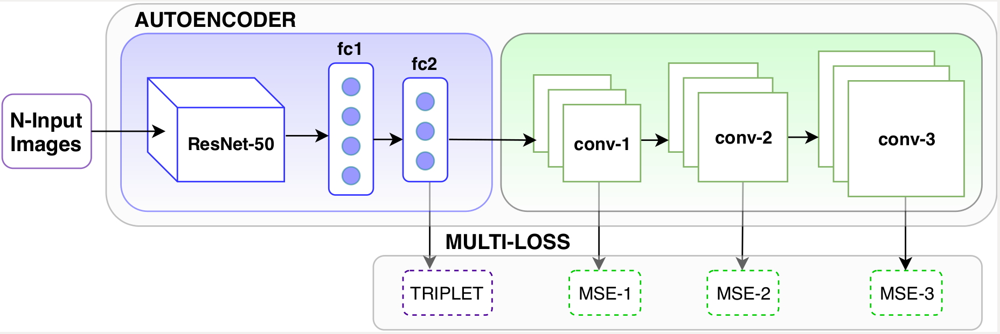

# Autoencoder-Ensemble-for-Person-Re-ID
This project aims at re-identify person using auto-encoder network. It is based on our IEEE-BigMM 2019 paper. 
The code is modified from our previous work [HDRNet](https://github.com/kajal15003/HDRNet.git).

# Architecture



# Installation
See Installation of [TensorFlow](https://www.tensorflow.org/) \
Tensorboard is also recommended for visualization.
- **This repository requires at least version 1.4 of TensorFlow.**
- **The TensorFlow code is Python 3 only and won't work in Python 2!**
- **Port Forwarding can be required to use tensorboard**

# Pre-processing

Please prepare the dataset as per instruction of [HDRNet](https://github.com/kajal15003/HDRNet.git).

# Training
```
Please replace the training file and loss file of HDRNet with the given files in this repository and train the model using the following command:

python train_v2exp3decorig.py or train1exp4dec.py \
          --train_set "dataset_path in csv format" \
          --image_root "dataset_path" \
          --experiment_root "log_path" \
          --initial_checkpoint init/resnet_v1_50.ckpt \
          --batch_p batch_size --margin 0.5 --flip_augment --crop_augment
```
# Feature Extraction
```
python feature.py \
--experiment_root "log_path" \
--dataset "dataset_path in csv format" \
--filename test_embeddings.h5 \
--flip_augment --crop_augment five --aggregator normalized_mean
```

# Evaluation
Use evaluate.py to compute cmc and mAP

# Reconstruction
Use embeddings.h5 file and give as an input to .ipynb file to reconstruct the images.

# Citation
If you use any of the provided code, please cite:
```
@inproceedings{kansal2019autoencoder,
  title={Autoencoder Ensemble for Person Re-Identification},
  author={Kansal, Kajal and Subramanyam, AV},
  booktitle={2019 IEEE Fifth International Conference on Multimedia Big Data (BigMM)},
  pages={257--261},
  year={2019},
  organization={IEEE}
}
```
